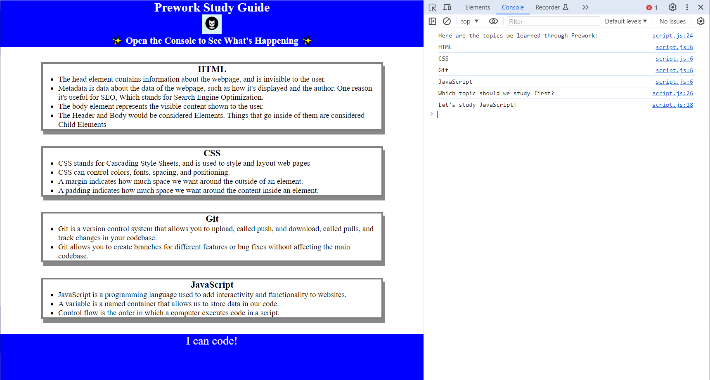

# Prework Study Guide

## What is This Project?

This is a study guide for people going to a coding boot camp. It has notes on HTML, CSS, Git, and JavaScript to help you prepare for boot camp.

- **Why Did I Make This?**: I made it to help myself  learn the basics before starting boot camp.
- **What's in It?**: It has notes about important things that I'll learn in boot camp.
- **What Did I Learn?**: I learned how to create a webpage, add styles with CSS, use Git for version control, and add interactivity with JavaScript.

## Table of Contents

Here's what's in this study guide:

- [Installation](#installation)
- [Usage](#usage)
- [Credits](#credits)
- [License](#license)

## Installation

This project doesn't require installation. To see it:

1. Download or clone this repository to your computer.
2. Open the `index.html` file with your web browser.

## How to Use This Guide

To use the guide, open your web browser's developer tools, I used Chrome. You can do this by pressing right clicking and pressing "Inspect" or also by using a keyboard shortcut `Control + Shift + I` on Windows. You can then look in the console to see notes on HTML, CSS, Git, and JavaScript.

```markdown


## Credits

Thanks to my bootcamp guide for providing helpful information on web development concepts. I also used the GitHub Markdown tutorial to learn how to format this README.

## License

MIT License

Copyright (c) 2024 James Ryan IV

Permission is hereby granted, free of charge, to any person obtaining a copy
of this software and associated documentation files (the "Software"), to deal
in the Software without restriction, including without limitation the rights
to use, copy, modify, merge, publish, distribute, sublicense, and/or sell
copies of the Software, and to permit persons to whom the Software is
furnished to do so, subject to the following conditions:

The above copyright notice and this permission notice shall be included in all
copies or substantial portions of the Software.

THE SOFTWARE IS PROVIDED "AS IS", WITHOUT WARRANTY OF ANY KIND, EXPRESS OR
IMPLIED, INCLUDING BUT NOT LIMITED TO THE WARRANTIES OF MERCHANTABILITY,
FITNESS FOR A PARTICULAR PURPOSE, AND NONINFRINGEMENT. IN NO EVENT SHALL THE
AUTHORS OR COPYRIGHT HOLDERS BE LIABLE FOR ANY CLAIM, DAMAGES, OR OTHER
LIABILITY, WHETHER IN AN ACTION OF CONTRACT, TORT OR OTHERWISE, ARISING FROM,
OUT OF OR IN CONNECTION WITH THE SOFTWARE OR THE USE OR OTHER DEALINGS IN THE
SOFTWARE.
